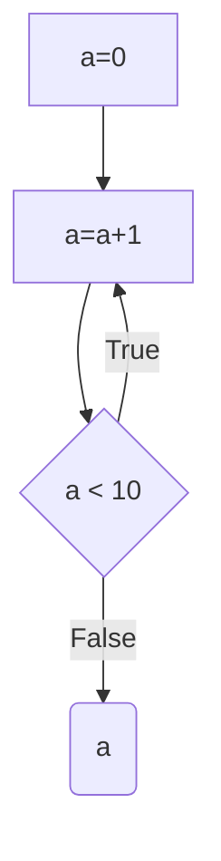

# Goto elimination

This repository contains code for [Taming Control Flow A Structured Approach to Eliminating Goto Statements](https://www.researchgate.net/publication/2609386_Taming_Control_Flow_A_Structured_Approach_to_Eliminating_Goto_Statements).

It's a pet project, so I used advanced tools. For an easy usage I provide a Dockerfile.

## Usage

Build docker:
```bash
docker build -t goto_elimination .
```

Run docker:
```bash
docker run -it -v $(pwd)/inputs:/tmp/inputs goto_elimination:latest /tmp/inputs/elim_while.txt
```

## Inputs

This code requires inputs in a form of a [Mermaid](https://mermaid-js.github.io/mermaid-live-editor/).
The following example shows all basic building blocks of the app (assignment, conditional, print).

Example input:
```text
graph TB
    A[a=0] --> B[a=a+1]
    B --> C{a < 10}
    C -->|True| B
    C -->|False| D(a)
```

The same input, but converted into a diagram:


Parsed code:
```cpp
#include <iostream>
using namespace std;

int main() {
int a=0;
/***************
*  Statement   *
***************/

A:                       a=0;
B:                       a=a+1;
C:                       if (a<10) { goto B; }
D:                       cout << a << endl;
}
```

Code with eliminated gotos:
```cpp
#include <iostream>
using namespace std;

int main() {
int a=0;
int _elim_C_f_=0;
/***************
*  Statement   *
***************/

A:                       a=0;
_elim_C_f_t_:            _elim_C_f_=1;
_elim_C:                 while (a<10 || _elim_C_f_) {
_elim_C_f_f_:              _elim_C_f_=0;
B:                         a=a+1;
                         }
C:                       (void)1; // Empty
D:                       cout << a << endl;
}
```
